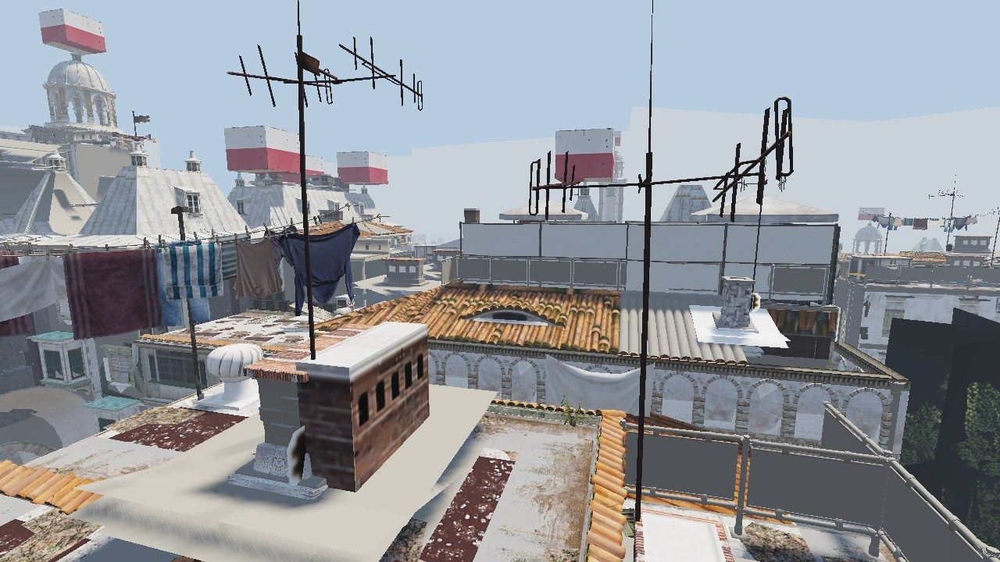
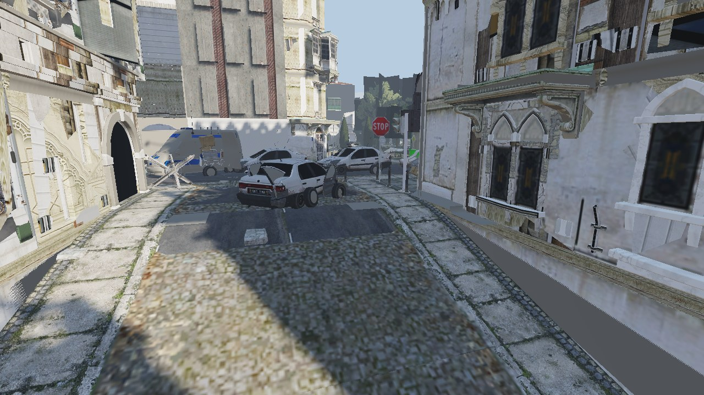
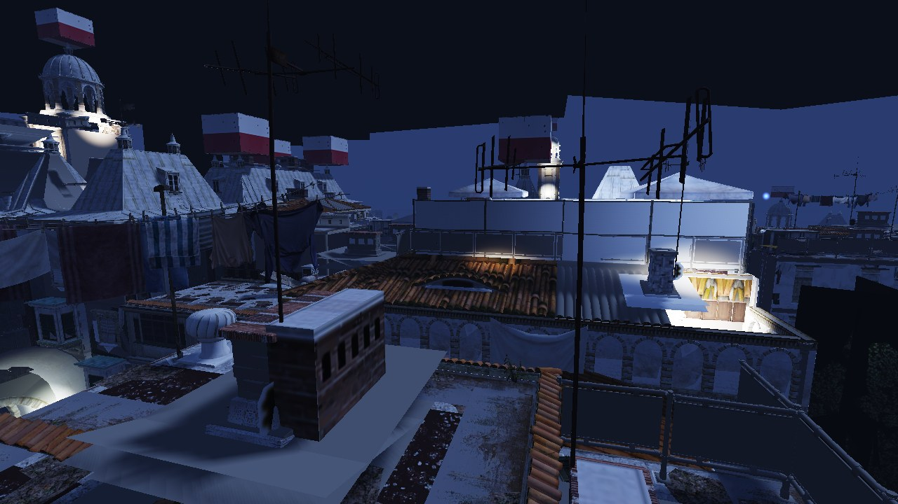
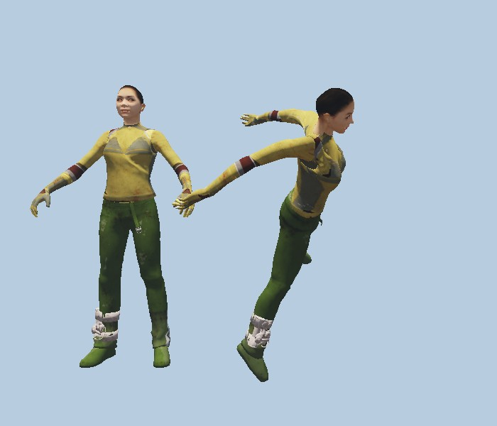

# openchrome

Independent, from-scratch runtime for **Dying Light (1)** (Chrome Engine 6), written in C++ with Vulkan and SDL2.

**Goal:** load and eventually play the original game from your own legitimately owned copy. Formats are reverse engineered from the data files; no game code or assets are included or distributed here.



<p>


</p>

*Screenshots are rendered by `oc_viewer` straight from the game files (Old Town map): materials and textures from the material database, sun and moon lighting, shadow map, point lights and lit windows at night.*

## What works

| Area | State |
|---|---|
| `.rpack` containers, resource names, streams | done, [spec](docs/formats/rpack.md) |
| Textures (BC1/BC3/RGBA8/R8/RGBA32F, mips) | done, [spec](docs/formats/texture.md) |
| Static meshes (vertex layouts, LODs, submeshes) | done, [spec](docs/formats/mesh.md) |
| Materials: templates, sampler to texture binding | done, [spec](docs/formats/mp.md) |
| Map placement (`.sobj`), terrain and horizon meshes | done, [spec](docs/formats/sobj.md) |
| Lights from `.exp` (lamps, window lights), night mode | done, [spec](docs/formats/exp.md) |
| Vulkan viewer: shadows, tone mapping, time of day, streaming textures | done |
| Skeletons, skin weights, static poses, CPU skinning | working, [spec](docs/formats/anim.md) |
| Animation tracks (bit-packed ANM2 streams) | in progress |
| Terrain layer blending, sky, vegetation, navmesh, gameplay | open |



### Characters

Character meshes are skinned kits (head, torso, legs, hair and their LODs as separate groups). The viewer reads the skeleton stored in the mesh, the per-submesh bone palettes and the vertex weights, then applies a pose from a static animation clip (here: bind pose and an NPC reset pose). Skin, clothes and faces use the textures bound by their materials; clothes are dyed from the `s_idx` mask and the `s_grd` colour palette (palette row 0 for now). Normal and specular maps are not applied yet.

```
oc_viewer "<DW dir>" old_town --nomap ^
  --spawn survivor_woman_a m_npc_reset_anim 0 0 0 0 ^
  --parts 53=survivor_woman_head_b.mat,116=survivor_woman_torso_b.mat,88=survivor_woman_legs_b.mat
```

<br clear="right">

## Build and run (Windows, MSVC + Vulkan SDK)

```
build.bat
build\oc_viewer.exe "F:\SteamLibrary\steamapps\common\Dying Light\DW" old_town
```

Controls: WASD fly, mouse look, Q/E down/up, Shift/Ctrl speed, wheel changes speed, `[` `]` shift the time of day, `N` toggles day/night, Esc quits.
Options: `--time H` hour of day, `--radius R` draw distance, `--shot out.ppm --cam x y z yaw pitch` write a screenshot and exit, `--spawn mesh clip x y z yaw` and `--parts`, `--nomap` for character tests. `oc_probe` decodes all meshes of a map as a smoke test.

Research tools live in `tools/` (Python, numpy/Pillow): unpack containers, export textures and models, inspect clips and skeletons. Format notes are in [`docs/formats/`](docs/formats/).

---

Unofficial fan project, not affiliated with Techland. Dying Light is a trademark of its owners.
